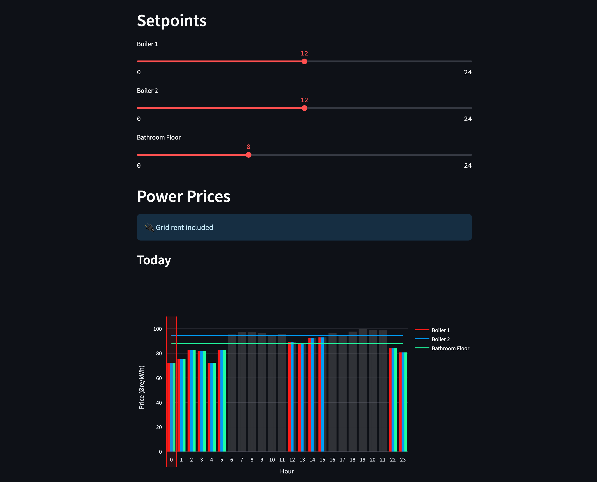

# Price-Driven Switch

## Description

A smart home automation package that controls appliances based on real-time electricity spot prices. Currently supports Tibber for price data and includes Norwegian grid rent calculations.




### Key Features

- **Real-time Price Control**: Provide RESTful api for controlling your devices based on electricity price using the smart home solution of your choice.
- **Even Hour Distribution**: Spreads operating hours throughout the day instead of clustering them, preventing all appliances from running consecutively during cheapest hours
- **Grid Rent Integration**: Supports Norwegian grid rent model with configurable rates for different seasons and time periods
- **Power Limiting**: Monitors total power consumption and automatically turns off low-priority appliances when exceeding limits, preventing you to go into the next price bracket with the grid provider. (Requires Tibber Pulse meter for real-time power draw monitoring)
- **Web Interface**: User-friendly Streamlit-based configuration interface
- **Docker Support**: Easy deployment with Docker and docker-compose

### Supported Price Providers

- **Tibber Spot Prices**: Real-time electricity prices from Tibber API
- **Norgespris Fixed Rate**: Norwegian fixed-price electricity model as an alternative to spot prices
- **Grid Rent**: Norwegian grid usage price model (default rates from BKK)


## Installation

### Docker (Recommended)

1. **Prerequisites**: Install [Docker](https://docs.docker.com/get-docker/) and docker-compose

2. **Quick Start**:
   ```bash
   # Download the docker-compose.yml file
   wget https://raw.githubusercontent.com/pavelapekhtin/price-driven-switch/main/docker-compose.yml

   # Start the container
   docker-compose up -d
   ```

3. **Custom Configuration**: Edit `docker-compose.yml` to change timezone (default: Europe/Oslo)

Tested to work on arm64 and amd64 architectures, if you want to run it on a different architecture you will have to build the image yourself, for this clone the repository, navigate to the repository folder in the terminal and run ```docker compose -f docker-compose.dev.yml up -d```. This will build the containers from local files.

### Local Installation

1. **Clone and Install**:
   ```bash
   git clone https://github.com/pavelapekhtin/price-driven-switch.git
   cd price-driven-switch
   pip install -e .
   ```

2. **Start Services**:
   ```bash
   # Web interface
   streamlit run price_driven_switch/frontend/1_📊_Dashboard.py

   # API server
   uvicorn price_driven_switch/__main__.py:app --reload
   ```

## Configuration

### Initial Setup

1. **Access Web Interface**: Navigate to `http://localhost` (Docker) or `http://localhost:8501` (local)
2. **Add Tibber Token**: Get your token from [Tibber Developer Settings](https://developer.tibber.com/settings/accesstoken)
3. **Configure Appliances**: Add and configure your appliances in the Settings page

### Appliance Configuration

Each appliance can be configured with:
- **Name**: Descriptive name for the appliance
- **Power Draw**: Power consumption in kW
- **Priority**: Priority level (1 = highest, used for power limiting)
- **Setpoint**: Price threshold for switching (0.0 - 1.0, representing 0-24 hours)

**How Setpoints Work:**
The system uses a binary tree traversal algorithm to evenly spread operating hours throughout the day. For example, if you set a setpoint of 0.5 (12 hours), instead of running during the 12 cheapest consecutive hours, the appliance will run during 12 hours that are distributed across the day. This prevents all appliances from clustering during the same cheap hours and helps balance your overall power consumption.

### Grid Rent Settings

Configure Norwegian grid rent rates:
- **Include Grid Rent**: Enable/disable grid rent calculations
- **Seasonal Rates**: Different rates for January-March vs April-December
- **Day/Night Rates**: Different rates for day (06:00-22:00) and night/weekend periods

### Norgespris Settings

Configure Norwegian fixed-price electricity:
- **Use Norgespris**: Enable fixed-price mode instead of Tibber spot prices
- **Fixed Rate**: Set your Norgespris rate in øre/kWh (e.g., 50.0 øre/kWh with VAT, 40.0 øre/kWh without VAT)
- **Grid Rent Compatibility**: Works seamlessly with grid rent - fixed price + time-varying grid rent

### Power Limiting

Set a maximum power limit to prevent exceeding your connection capacity:
- **Power Limit**: Maximum total power draw in kW
- **Automatic Control**: System automatically turns off low-priority appliances when limit is exceeded
- **Disable**: Set limit to 0 to disable this feature

## API Usage

### Get Appliance States

```http
GET http://your-server-address/api/
```

**Response**:
```json
{
    "Boiler 1": 1,
    "Boiler 2": 0,
    "Bathroom Floor": 1
}
```

### Integration Examples

#### Homebridge with homebridge-http-switch plugin

You can set up Homebrige to show an on/off switch in HomeKit and build an automation off it (if this switch is on, then turn the boiler on, etc). Below is the config example for setting up a switch that would report the on/off command from this package.

Install the [homebridge-http-switch](https://github.com/homebridge-plugins/homebridge-http-switch) plugin:

Configure your `config.json` to create switches for each appliance,

```json
"accessories": [
        {
            "accessory": "HTTP-SWITCH",
            "name": "Boiler R API State",
            "serialNumber": "BR001",
            "switchType": "stateful",
            "onUrl": {
                "url": "http://192.168.10.192/api/",
                "method": "POST",
                "body": {
                    "Boiler R": 1,
                    "Boiler L": 0,
                    "Floor": 0
                },
                "headers": {
                    "Content-Type": "application/json"
                }
            },
            "offUrl": {
                "url": "http://192.168.10.192/api/",
                "method": "POST",
                "body": {
                    "Boiler R": 0,
                    "Boiler L": 0,
                    "Floor": 0
                },
                "headers": {
                    "Content-Type": "application/json"
                }
            },
            "statusUrl": {
                "url": "http://192.168.10.192/api/",
                "method": "GET",
                "headers": {
                    "Content-Type": "application/json"
                }
            },
            "statusPattern": "\"Boiler R\":\\s*1",
            "pullInterval": 5000
        },
]
```

**Configuration Options:**
- `name`: Display name in HomeKit
- `switchType`: Use "stateful" for appliances that can be on/off


## Troubleshooting

### Common Issues

1. **Price Graphs Show Wrong Currency**: Currently displays Øre/kWh (Norwegian format)
2. **Setpoint Slider Issues**: Try refreshing the page if sliders don't save properly
3. **Timezone Issues**: Change timezone in docker-compose.yml file: `TZ=Europe/Oslo`

### Logs

Check container logs for debugging:
```bash
docker-compose logs -f price-driven-switch
```

## Development

### Project Structure

```
price_driven_switch/
├── backend/           # Core logic and API
│   ├── configuration.py  # Settings management
│   ├── grid_rent.py      # Grid rent calculations
│   ├── switch_logic.py   # Appliance control logic
│   └── tibber_connection.py  # Tibber API integration
├── frontend/          # Streamlit web interface
├── config/           # Configuration files
└── tests/            # Test suite
```

### Running Tests

```bash
# Run all tests
pytest

# Run specific test categories
pytest tests/unit/
pytest tests/integration/
pytest tests/acceptance/
```

### Contributing

1. Fork the repository
2. Create a feature branch
3. Make your changes
4. Add tests for new functionality
5. Ensure all checks pass: `ruff check && mypy . && pytest`
6. Submit a pull request

Please not that grid rent model features were vibe-coded, so code is a bit messy in those places and containes unneeded comments.

## Roadmap

### Completed ✅
- [x] Rework setpoints and appliances value saving
- [x] Add support for limiting the hourly load
- [x] Grid rent integration with Norwegian pricing model
- [x] Comprehensive holiday detection (Easter, Pentecost, etc.)
- [x] Automatic settings validation and migration
- [x] Add Norgespris support

### Planned 🚧
- [ ] Allow to switch even hour distribution on and off
- [ ] Add currency selection to settings page
- [ ] Fix cutoff line colors behaviour
- [ ] Add timezone selection to settings page
- [ ] Support for additional price providers

## License

[Add your license information here]

## Support

For issues and questions:
- [GitHub Issues](https://github.com/pavelapekhtin/price-driven-switch/issues)

---

**Note**: This application is designed for Norwegian electricity markets but can be adapted for other regions by modifying the grid rent calculations and holiday detection.
